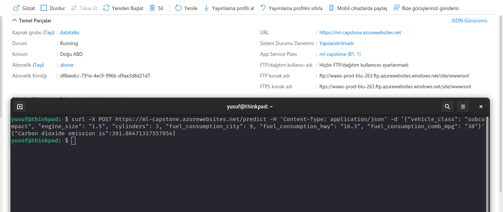

## Project info 
In this project we're predicting Co^2 emissions for car. Giving some car feautres such as cylinders, engine size, transmission etc, predicting CO2 emissions.


## Data And Variable
### Model ###

4WD/4X4 = Four-wheel drive
AWD = All-wheel drive
FFV = Flexible-fuel vehicle
SWB = Short wheelbase
LWB = Long wheelbase
EWB = Extended wheelbase

### Transmission ###

A = Automatic
AM = Automated manual
AS = Automatic with select shift
AV = Continuously variable
M = Manual
3 - 10 = Number of gears
### Fuel type ###

X = Regular gasoline
Z = Premium gasoline
D = Diesel
E = Ethanol (E85)
N = Natural gas

### Fuel Consumption ###


City and highway fuel consumption ratings are shown in litres per 100 kilometres (L/100 km) - the combined rating (55% city, 45% hwy) is shown in L/100 km and in miles per gallon (mpg)


**Data and variable explanation source**:  [Kaggle](https://www.kaggle.com/debajyotipodder/co2-emission-by-vehicles)


## File Descriptions

* `notebook.ipynb`  Notebook contains data  preparation, EDA, parameter tuning,model selection and saving model.
* `predict.py` Python file contains model file and serving as Flask app.
* `predict_test.py` Python file contains one observation for probility and CHD risk result. **(local solution)**
* `cloud_predict.py ` Python file contains model for one observation and includes cloud endpoint. **(cloud solution)**
* `requirements.txt` Txt file contains all dependencies  for notebook.ipynb and predictions scripts. 


## Preparing Python Environments


```bash
git clone https://github.com/yusyel/ML-bookcamp-capstone.git
```


```bash
cd ML-bookcamp-capstone
```

> Activate python environments
```bash
pipenv shell
```
> In python environment installing python dependency:

```bash
pip install -r requirements.txt
```
## Preparing And Running Docker Image


> For building docker image:
```bash
docker build -t capstone .
```
> After building docker image you can run docker image with this command:

```bash
docker run -it --rm -p 9696:9696 capstone 
```

## Runing Predictions File

> While docker container running In your python shell:

```bash
python3 predict_test.py
```
*  We can use predict_test.py file or we can use curl utility. [Tanks to Carolina.](https://github.com/diascarolina/project-insurance-forecast)

```bash
curl -X POST http://localhost:9696/predict \
-H 'Content-Type: application/json' \
-d '{"vehicle_class": "subcompact", "engine_size": "1.5", "cylinders": 3, "fuel_consumption_city": 9, "fuel_consumption_hwy": "6.3", "fuel_consumption_comb_mpg": "38"}'
```

> Cloud test. `cloud_predict.py` contains server endpoint.

```bash
python3 cloud_predict.py
```
* cloud deployment I choose Azure. Screnshoot contanins endpoint and returning predictions.
```bash
curl -X POST https://ml-capstone.azurewebsites.net/predict \
-H 'Content-Type: application/json' \
-d '{"vehicle_class": "subcompact", "engine_size": "1.5", "cylinders": 3, "fuel_consumption_city": 9, "fuel_consumption_hwy": "6.3", "fuel_consumption_comb_mpg": "38"}'
```

* I choose Azure for cloud deployment. Screnshoot contanins endpoint and returning predictions.)




https://raw.githubusercontent.com/yusyel/ML-bookcamp-capstone/master/cloud.mp4